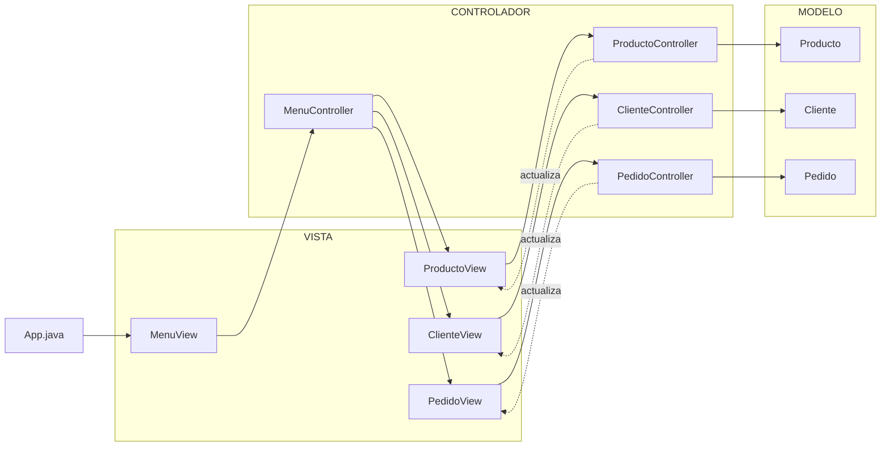

# tech-store-express

## Integrantes:

- Nicolle Mera Gomez
- Ethan Alejandro Mezu Quizaboni

## Diagrama

- **Modelo:** contiene las clases que representan y gestionan los datos de la aplicación: `Producto`, `Cliente` y `Pedido`.

- **Vista:** contiene las interfaces gráficas (`MenuView`, `ProductoView`, `ClienteView` y `PedidoView`), encargadas de mostrar la información y recibir las acciones del usuario.

- **Controlador:** contiene `MenuController`, `ProductoController`, `ClienteController` y `PedidoController`, encargados de coordinar las acciones entre las vistas y los modelos.

- **App.java:** se encarga de iniciar la interfaz.

- **Menú principal:** permite acceder a las diferentes áreas de gestión de la aplicación: productos, clientes y pedidos.

